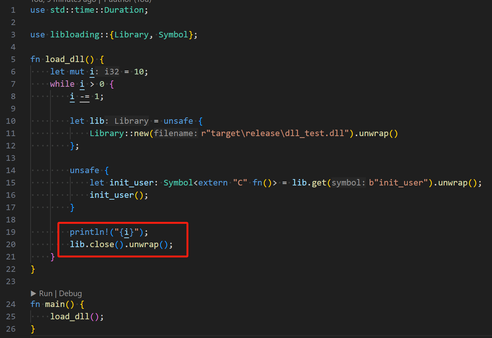
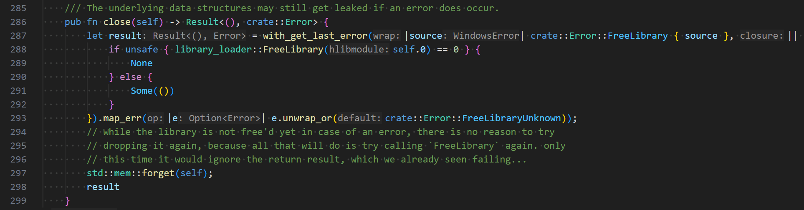

# Issue: 连续的 加载/运行/卸载 DLL, 内存不断增加 (Windows 环境下)

一检查 竟然是 println 导致了内存泄露? 最后, 分析确定: 是 OnceLock 导致的!!!

## 编译动态库

```sh
cargo build
```

## 编译测试程序

测试代码, 不断地 加载 / 运行 / 卸载.

cargo build --example dll_test

可以确定, 执行了 动态库的释放:





## 使用 drmemory 验证 测试程序中的 内存泄露问题

drmemory.exe -logdir ./logs -ignore_kernel -batch -exit_code_if_errors 0 -- .\target\debug\examples\dll_test.exe

tips:
(1) 我这里运行时, 会有 2 个错误弹框, 忽略.
(2) 内存分析工具 drmemory: https://github.com/DynamoRIO/drmemory/releases

## 测试的结果 (也可以看 测试输出最后一行指定的 测试结果文件):

内存泄露, 如果 我把整个过程循环 10000 次, 内存就达到 几百兆 !!!


测试结果的文件中, 可以看到, 循环 10 次的话, 刚好 出现内存泄露 10 次:


## 命令

通过不断修改 src/lib.rs 和 examples/dll_test.rs, 分析不同的测试代码

```
cargo build; cargo build --example dll_test

drmemory.exe -logdir ./logs -ignore_kernel -batch -exit_code_if_errors 0 -- .\target\debug\examples\dll_test.exe
```

## 总结

(1) 动态库被卸载后, OnceLock 会导致内存未被释放, 具体原因, 只能以后 去研究 rust 源码. 可以根据应用的场景, 选择不同的方案

(2) 通过 drmemory 工具, 可以很好的分析到 泄露的内存 的代码, DLL 一般都先做测试, 分析过没有问题, 才算 Safe
