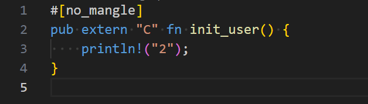
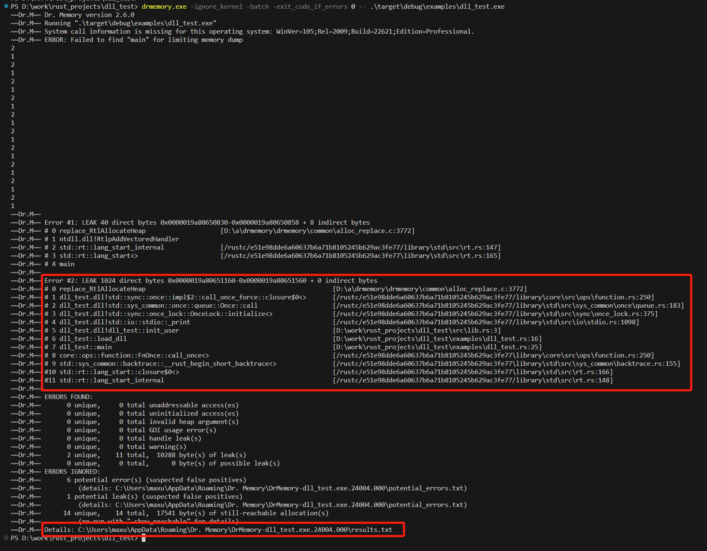
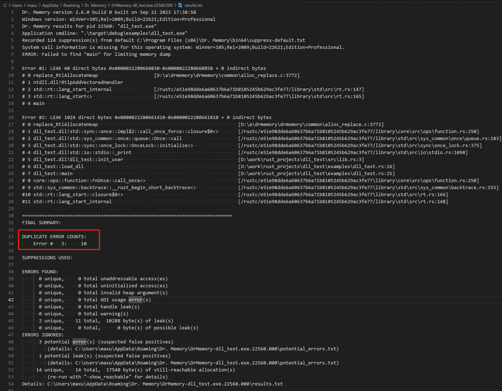

# Issue: 连续的 加载/运行/卸载 DLL, 内存不断增加 (Windows 环境下)

一检查 竟然是 println 导致了内存泄露?

## 编译动态库

这是一个简单的动态库, 只有一个函数:

```sh
cargo build --release
```



## 编译测试程序

测试代码, 不断地 加载 / 运行 / 卸载.

cargo build --example dll_test


## 使用 drmemory 验证 测试程序中的 内存泄露问题

drmemory.exe -ignore_kernel -batch -exit_code_if_errors 0 -- .\target\debug\examples\dll_test.exe

tips:
(1) 我这里运行时, 会有 2 个错误弹框, 忽略.
(2) 内存分析工具 drmemory: https://github.com/DynamoRIO/drmemory/releases

## 测试的结果 (也可以看 测试输出最后一行指定的 测试结果文件):

内存泄露, 如果 我把整个过程循环 10000次, 内存就达到 几百兆 !!!



测试结果的文件中, 可以看到, 循环10次的话, 刚好 出现内存泄露 10次:


